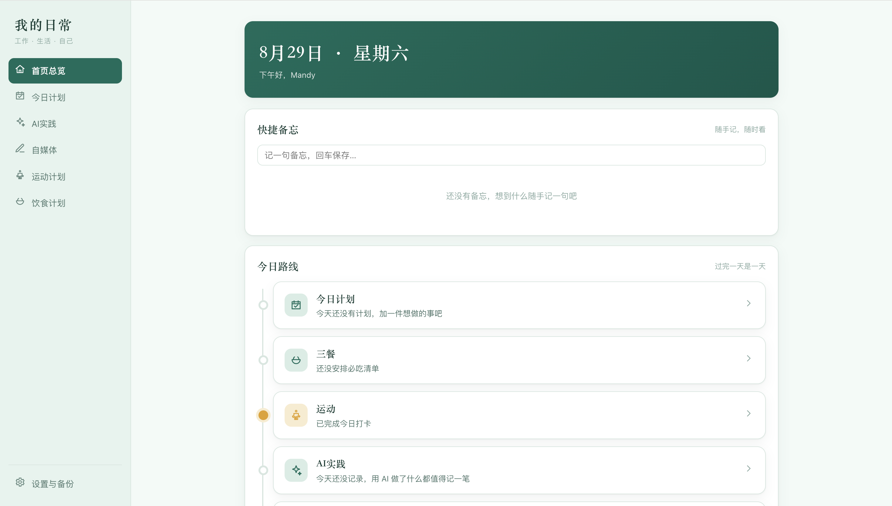

# my-dailyboard

> 一个人的每日成长看板 —— 饮食、运动、AI 实践与自媒体进度，一站式追踪。

## 简介

my-dailyboard 是一个**个人工作台应用**，用于记录和管理日常生活与自我提升的几条主线：

- 🍽️ **饮食计划** —— 每日必吃清单与打卡记录
- 🏃 **运动计划** —— 运动安排与打卡追踪
- 🤖 **AI 实践** —— AI 使用日志与提示词模板库
- 📱 **自媒体进度管理** —— 内容创作进度追踪

这个项目诞生于一次职业转型期，希望用一个简单直观的工具，把生活节奏和学习/成长节奏都管理起来。

> 应用仅在本机运行，**无需登录、无需联网、无需云服务**，数据保存在本地独立文件中。

## 功能特性

- 🏠 **首页总览**：一条「今日路线」串联 计划 / 三餐 / 运动 / AI / 自媒体 的今日摘要，支持快捷备忘
- ✅ **今日计划**：按日管理待办事项（优先级、备注），带日历回看历史计划
- 🍽️ **饮食计划**：每日必吃模板一键带入本周，每天打卡「吃过 / 没吃」，带打卡日历
- 🏃 **运动计划**：制定每周计划（练什么、练多久），每日打卡并记录实际时长与额外锻炼，带打卡日历
- 🤖 **AI 实践**：AI 使用日志（动作 / 收获）+ 提示词模板库（分类 / 场景 / 效果，一键复制）
- 📱 **自媒体**：灵感库 + 内容管理（灵感 → 撰写 → 待发布 → 已发布 全流程流转、平台筛选、本月统计）
- 🎨 **5 套界面风格**：暖色手账 / 薄荷晨光 / 深夜墨蓝 / 编辑部黑白 / 暖阳奶油，一键切换并自动保存
- 💾 **本地存储**：数据保存为 `data/` 下的独立 JSON 文件，改动自动保存，支持一键备份 / 恢复


## 技术栈

- **前端**：原生 HTML / CSS / JavaScript（无框架、无构建步骤）
- **后端**：Node.js 内置 `http` 模块（零第三方依赖）
- **数据存储**：本地 JSON 文件（`data/` 目录，每个模块一个文件）
- **测试**：Node.js 内置 test runner + Playwright 无头浏览器端到端测试


## 项目结构

```
my-dailyboard/
├── PRD.md               # 产品需求文档
├── README.md            # 本文件
├── 使用说明.txt          # 面向最终用户的使用说明
├── 启动.command          # macOS 双击启动器（自动开浏览器）
├── server.js            # 本地服务：静态页面 + 数据 API + 备份/恢复
├── public/              # 前端
│   ├── index.html       # 页面骨架（侧边导航 + 内容区）
│   ├── css/style.css    # 样式（含 5 套主题）
│   └── js/
│       ├── app.js       # 路由与初始化
│       ├── api.js       # 与本地服务通信
│       ├── store.js     # 数据缓存 + 自动保存
│       ├── ui.js        # 通用 UI 组件（弹窗 / 提示 / 图标）
│       ├── dates.js     # 日期工具
│       ├── calendar.js  # 通用日历弹窗
│       └── views/       # 各板块视图
│           ├── home.js  today.js  ai.js
│           ├── media.js exercise.js diet.js settings.js
├── data/                # 运行后生成：JSON 数据文件（已 gitignore，不入库）
└── test/                # 自动化测试（服务端 + 端到端，共 23 个测试文件）
```


## 快速开始


### 环境要求

- **Node.js** ≥ 18（开发环境为 v24）
- **macOS**（启动器为 `.command` 脚本；其他系统可用命令行方式运行）


### 安装

本项目**零依赖**，克隆后无需 `npm install`：

```bash
git clone https://github.com/mandychan316/my-dailyboard.git
cd my-dailyboard
```


### 运行

**方式一（macOS 推荐）**：双击 `启动.command`，自动启动服务并打开浏览器。

**方式二（命令行）**：

```
node server.js          # 默认端口 8765
```

然后浏览器访问 [http://127.0.0.1:8765](http://127.0.0.1:8765) 即可。

### 运行测试

```bash
node --test
```

端到端测试需要本机 Chrome，可通过环境变量指定路径（不设置时使用默认路径）：

```bash
CHROME_PATH=/path/to/chrome PLAYWRIGHT_PATH=/path/to/playwright node --test
```


## 使用截图



> 更多页面截图陆续补充。


## Roadmap

- 📊 更多维度的数据统计（自媒体涨粉追踪、运动/饮食周报等）
- 📱 移动端适配完善
- ⏰ 提醒 / 通知
- 🧩 更丰富的 AI 实践可视化


## License

本项目基于 [MIT License](LICENSE) 开源。

## 关于作者

一名前电商产品经理，目前在转型期探索 AI 与自媒体。欢迎交流与建议！